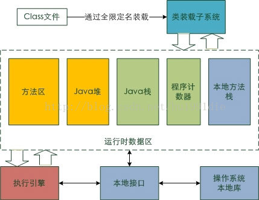

# JVM 结构

### jvm体系结构

- Java文件经过编译后变成 .class 字节码文件
- 字节码文件通过类加载器被搬运到 JVM 虚拟机中
- 虚拟机主要的5大块：方法区，堆都为线程共享区域，有线程安全问题，栈和本地方法栈和计数器都是独享区域，不存在线程安全问题，而 JVM 的调优主要就是围绕堆，栈两大块进行。

### 类加载器

#### 类加载过程

- 加载，查找并加载类的二进制数据，在Java堆中也创建一个java.lang.Class类的对象
- 连接，连接又包含三块内容：验证、准备、初始化。1）验证，文件格式、元数据、字节码、符号引用验证；2）准备，为类的静态变量分配内存，并将其初始化为默认值；3）解析，把类中的符号引用转换为直接引用
- 初始化，为类的静态变量赋予正确的初始值
- 使用，new出对象程序中使用
- 卸载，执行垃圾回收

#### 类加载顺序

加载一个Class类的顺序也是有优先级的，类加载器从最底层开始往上的顺序是这样的：

- BootStrap ClassLoader：rt.jar
- Extention ClassLoader: 加载扩展的jar包
- App ClassLoader：指定的classpath下面的jar包
- Custom ClassLoader：自定义的类加载器

### jvm运行时数据区

### jvm内存模型

jvm运行时内存 = 共享内存区 + 线程内存区

#### 共享内存区

1）共享内存区划分

- ​	共享内存区 = 持久代 + 堆（1.7之前是持久代、之后是元数据空间）
- ​	持久代 = 方法区 + 其他
- ​    堆 = 年老代 + 年轻带 
- ​    年轻带 = Eden + S0 + S1 

2）一些参数的配置

- 默认的，新生代 ( Young ) 与老年代 ( Old ) 的比例的值为 1:2 ，可以通过参数 **–XX:NewRatio** 配置。
- 默认的，Edem : from : to = 8 : 1 : 1 ( 可以通过参数 **–XX:SurvivorRatio** 来设定)
- Survivor区中的对象被复制次数为15(对应虚拟机参数 **-XX:+MaxTenuringThreshold**)

##### 持久代

​	**JVM用持久带（Permanent Space）实现方法区，**主要存放所有已加载的类信息，方法信息，常量池等等**。

​	可通过**-XX:PermSize**和**-XX:MaxPermSize**来指定持久带初始化值和最大值。

​	Permanent Space并不等同于方法区，只不过是Hotspot JVM用Permanent Space来实现方法区而已，有些虚拟机没有Permanent Space而用其他机制来实现方法区。

##### 堆

​	堆(heap)，主要用来存放类的对象实例信息（包括new操作实例化的对象和定义的数组）。

​	堆分为Old Space（又名，Tenured Generation）和Young Space。

​	Old Space主要存放应用程序中生命周期长的存活对象；

​	Eden(伊甸园)主要存放新生的对象；

​	S0和S1是两个大小相同的内存区域，主要存放每次垃圾回收后Eden存活的对象，作为对象从Eden过渡到Old Space的缓冲地带（S是指英文单词Survivor Space）。堆之所以要划分区间，是为了方便对象创建和垃圾回收，后面垃圾回收部分会解释。

#### 线程内存区

​	线程内存区 = 单个线程内存 + 单个线程内存 + .......

​	单个线程内存 = PC Regster（寄存器） + JVM栈 + 本地方法栈

​	JVM栈 = 栈帧 + 栈帧 + .....

​	栈帧 = 局域变量区 + 操作数区 + 帧数据区

**在Java中，一个线程会对应一个JVM栈(JVM Stack)，JVM栈里记录了线程的运行状态。**

##### 虚拟机栈（JVM Stacks）

JVM栈以栈帧为单位组成，一个栈帧代表一个方法调用。栈帧由三部分组成：局部变量区、操作数栈、帧数据区。

- Java虚拟机栈是线程私有的，每一个线程都有独享一个虚拟机栈，它的生命周期与线程相同。
- 虚拟机栈描述的是Java方法执行的内存模型：每个方法被执行的时候都会同时创建一个栈帧（Stack Frame）用于存储局部变量表、操作栈、动态链接、方法出口等信息。每一个方法被调用直至执行完成的过程，就对应着一个栈帧在虚拟机栈中从入栈到出栈的过程。
- 存放基本数据类型（boolean、byte、char、short、int、float、long、double）以及对象的引用（reference类型，它不等同于对象本身，根据不同的虚拟机实现，它可能是一个指向对象起始地址的引用指针，也可能指向一个代表对象的句柄或者其他与此对象相关的位置）和returnAddress类型（指向了一条字节码指令的地址）。
- 这个区域可能有两种异常：如果线程请求的栈深度大于虚拟机所允许的深度，将抛出StackOverflowError异常；如果虚拟机栈可以动态扩，当扩展时无法申请到足够的内存时会抛出OutOfMemoryError异常。

##### 程序计数器（Program Counter Register）

它的作用就是记录当前线程所执行的位置。 这样，当线程重新获得CPU的执行权的时候，就直接从记录的位置开始执行，分支、循环、跳转、异常处理也都依赖这个程序计数器来完成。

##### 本地方法栈（Native Method Stacks）

本地方法栈与虚拟机栈所发挥的作用是非常相似的，其区别不过是虚拟机栈为虚拟机执行Java方法（也就是字节码）服务，而本地方法栈则是为虚拟机使用到的Native方法服务。

虚拟机规范中对本地方法栈中的方法使用的语言、使用方式与数据结构并没有强制规定，因此具体的虚拟机可以自由实现它。甚至有的虚拟机（譬如Sun HotSpot虚拟机）直接就把本地方法栈和虚拟机栈合二为一。与虚拟机栈一样，本地方法栈区域也会抛出StackOverflowError和OutOfMemoryError异常。

### 堆溢出

堆（Heap）是Java存放对象实例的地方。

堆溢出可以分为以下两种情况，这两种情况都会抛出OutOfMemoryError:java heap space异常：

#### 内存泄露

**内存泄漏是指对象实例在新建和使用完毕后，仍然被引用，没能被垃圾回收释放，一直积累，直到没有剩余内存可用。**

如果内存泄露，我们要找出泄露的对象是怎么被GC ROOT引用起来，然后通过引用链来具体分析泄露的原因。分析内存泄漏的工具有：Jprofiler，visualvm等。

#### 内存溢出

**内存溢出是指当我们新建一个实力对象时，实例对象所需占用的内存空间大于堆的可用空间。**

如果出现了内存溢出问题，这往往是程序本生需要的内存大于了我们给虚拟机配置的内存，这种情况下，我们可以采用调大-Xmx来解决这种问题。

### 线程栈

**栈（JVM Stack）存放主要是栈帧( 局部变量表, 操作数栈 , 动态链接 , 方法出口信息 )的地方。注意区分栈和栈帧：栈里包含栈帧。**

与线程栈相关的内存异常有两个：

a）、StackOverflowError ：

​	出现此种情况是因为方法运行的时候，请求新建栈帧时，栈所剩空间小于战帧所需空间。例如，通过递归调用方法,不停的产生栈帧,一直把栈空间堆满,直到抛出异常

b）、OutOfMemoryError（线程太多，内存不够新建线程）

- 栈是线程私有的，他的生命周期与线程相同，每个方法在执行的时候都会创建一个栈帧，用来存储局部变量表，操作数栈，动态链接，方法出口等信息。局部变量表又包含基本数据类型，对象引用类型
- 如果线程请求的栈深度大于虚拟机所允许的最大深度，将抛出StackOverflowError异常，方法递归调用产生这种结果。
- 如果Java虚拟机栈可以动态扩展，并且扩展的动作已经尝试过，但是无法申请到足够的内存去完成扩展，或者在新建立线程的时候没有足够的内存去创建对应的虚拟机栈，那么Java虚拟机将抛出一个OutOfMemory 异常。(线程启动过多)
- 参数 -Xss 去调整JVM栈的大小

# 垃圾回收

### 确定对象死亡

通常，判断一个对象是否被销毁有两种方法：

- 引用计数算法：为对象添加一个引用计数器，每当对象在一个地方被引用，则该计数器加1；每当对象引用失效时，计数器减1。但计数器为0的时候，就表白该对象没有被引用。
- 可达性分析算法：通过一系列被称之为“GC Roots”的根节点开始，沿着引用链进行搜索，凡是在引用链上的对象都不会被回收。

### 垃圾回收算法

#### 标记--清除算法

见名知义，标记--清除算法就是对无效的对象进行标记，然后清除。

容易产生碎片。

#### 复制算法

标记--复制算法就是把Java堆分成两块，每次垃圾回收时只使用其中一块，然后把存活的对象全部移动到另一块区域。

占用一般内存，但没有碎片

#### 标记--整理算法

标记--整理算法算是一种折中的垃圾收集算法，在对象标记的过程，和前面两个执行的是一样步骤。但是，进行标记之后，存活的对象会移动到堆的一端，然后直接清理存活对象以外的区域就可以了。这样，既避免了内存碎片，也不存在堆空间浪费的说法了。但是，每次进行垃圾回收的时候，都要暂停所有的用户线程，特别是对老年代的对象回收，则需要更长的回收时间，这对用户体验是非常不好的。

### GC类型

- Minor GC/Young GC：针对新生代的垃圾收集；
- Major GC/Old GC：针对老年代的垃圾收集。
- Full GC：针对整个Java堆以及方法区的垃圾收集。

#### Minor GC工作原理

通常情况下，初次被创建的对象存放在新生代的Eden区，当第一次触发Minor GC，Eden区存活的对象被转移到Survivor区的某一块区域。以后再次触发Minor GC的时候，Eden区的对象连同一块Survivor区的对象一起，被转移到了另一块Survivor区。可以看到，这两块Survivor区我们每一次只使用其中的一块，这样也仅仅是浪费了一块Survivor区。

#### Full GC工作原理

老年代是存储长期存活的对象的，占满时就会触发我们最常听说的Full GC，期间会停止所有线程等待GC的完成。所以对于响应要求高的应用应该尽量去减少发生Full GC从而避免响应超时的问题。

### 垃圾收集器

#### Serial收集器

Serial收集器是最基础、历史最悠久的收集器，是一个**单线程**工作的收集器，使用 Serial收集器，无论是进行 Minor gc 还是 Full GC ，清理堆空间时，所有的应用线程都会被暂停。

#### ParNew收集器

ParNew 收集器实质上是 **Serial 收集器的多线程并行版本**，除了同时使用多条线程进行垃圾收集之外，其余的行为包括 Serial 收集器可用的所有控制参数、收集算法、Stop The World、对象分配规则、回收策略等都与 Serial 收集器完全一致。

#### Parallel Scavenge收集器

Parallel Scavenge收集器也是一款**新生代收集器**，基于**标记——复制算法**实现，能够并行收集的多线程收集器和 ParNew 非常相似。

Parallel Scavenge 收集器的目标则是达到一个**可控制的吞吐量**（Throughput）。所谓吞吐量就是处理器用于运行用户代码的时间与处理器总消耗时间的比值。如果虚拟机完成某个任务，用户代码加上垃圾收集总共耗费了100分钟，其中垃圾收集花掉1分钟，那吞吐量就是99%。

#### Serial Old收集器

Serial Old是Serial收集器的老年代版本，它同样是一个单线程收集器，使用**标记-整理算法**。

#### Parallel Old收集器

Parallel Old是Parallel Scavenge收集器的老年代版本，支持多线程并发收集，基于**标记-整理算法**实现。

#### CMS收集器

- 初始标记(CMS-initial-mark) ,会导致stw;
- 并发标记(CMS-concurrent-mark)，与用户线程同时运行；
- 预清理（CMS-concurrent-preclean），与用户线程同时运行；
- 可被终止的预清理（CMS-concurrent-abortable-preclean） 与用户线程同时运行；
- 重新标记(CMS-remark) ，会导致stw；
- 并发清除(CMS-concurrent-sweep)，与用户线程同时运行；
- 并发重置状态等待下次CMS的触发(CMS-concurrent-reset)，与用户线程同时运行；

#### G1收集器

Garbage-First，面向服务端的垃圾收集器。

- 并行与并发：充分利用多核环境减少停顿时间，
- 分代收集：不需要配合其它收集器
- 空间整合：整体上看属于标记整理算法，局部（region之间）数据复制算法，运作期间不会产生空间碎片
- 停顿可预测，建立可以预测的停顿时间模型。

内存管理：

- 将整个java堆划分为多个大小形同的区域region，新生代和老年代都是region的集合。可以有计划的避免在全区域内进行垃圾收集。

- 回收方式：跟踪每一个region里面的垃圾堆积的价值大小（回收所得的空间大小以及所需耗费时间的经验值），维护一个优先列表，每次根据允许的回收时间，优先回收价值最大的region（GI名字由来），

- region之间的引用，新生代和老年带之间的引用根据remebered set来避免全盘扫描，每一个region都维护一个remebered set，

- 初始标记-》并发标记-》最终标记-》筛选回收，类CMS

  | 差异点   | CMS                          | G1             |
  | -------- | ---------------------------- | -------------- |
  | 应用区域 | 老年代，配合serial或者perNew | 独立，全部     |
  | 停顿时间 | 最小停顿时间                 | 可预测停顿时间 |
  | 清理方法 | 标记清楚，产生碎片           | 标记整理       |

  

# JVM调优

### JVM命令

Sun JDK监控和故障处理命令有jps、jstat、jmap、jhat、jstack、jinfo

#### jps

JVM Process Status Tool，显示指定系统内所有的HotSpot虚拟机进程。

#### jstat

jstat(JVM statistics Monitoring)是用于监视虚拟机运行时状态信息的命令，它可以显示出虚拟机进程中的类装载、内存、垃圾收集、JIT编译等运行数据。

#### jmap

dump堆到文件，可用于对文件的分析。

#### jhat

jhat(JVM Heap Analysis Tool)命令是与jmap搭配使用，用来分析jmap生成的dump，jhat内置了一个微型的HTTP/HTML服务器，生成dump的分析结果后，可以在浏览器中查看。在此要注意，一般不会直接在服务器上进行分析，因为jhat是一个耗时并且耗费硬件资源的过程，一般把服务器生成的dump文件复制到本地或其他机器上进行分析。

#### jstack

jstack用于生成java虚拟机当前时刻的线程快照。线程快照是当前java虚拟机内每一条线程正在执行的方法堆栈的集合，生成线程快照的主要目的是定位线程出现长时间停顿的原因，如线程间死锁、死循环、请求外部资源导致的长时间等待等。线程出现停顿的时候通过jstack来查看各个线程的调用堆栈，就可以知道没有响应的线程到底在后台做什么事情，或者等待什么资源。

### 选择合适的垃圾回收器

- CPU单核，那么毫无疑问Serial 垃圾收集器是你唯一的选择。
- CPU多核，关注吞吐量 ，那么选择PS+PO组合。
- CPU多核，关注用户停顿时间，JDK版本1.6或者1.7，那么选择CMS。
- CPU多核，关注用户停顿时间，JDK1.8及以上，JVM可用内存6G以上，那么选择G1。

**参数配置：**

 //设置Serial垃圾收集器（新生代）
 开启：-XX:+UseSerialGC

 //设置PS+PO,新生代使用功能Parallel Scavenge 老年代将会使用Parallel Old收集器
 开启 -XX:+UseParallelOldGC

 //CMS垃圾收集器（老年代）
 开启 -XX:+UseConcMarkSweepGC

 //设置G1垃圾收集器
 开启 -XX:+UseG1GC

### 调整内存大小

现象：垃圾收集频率非常频繁。

原因：如果内存太小，就会导致频繁的需要进行垃圾收集才能释放出足够的空间来创建新的对象，所以增加堆内存大小的效果是非常显而易见的。

注意：如果垃圾收集次数非常频繁，但是每次能回收的对象非常少，那么这个时候并非内存太小，而可能是内存泄露导致对象无法回收，从而造成频繁GC。

**参数配置：**

 //设置堆初始值
 指令1：-Xms2g
 指令2：-XX:InitialHeapSize=2048m

 //设置堆区最大值
 指令1：`-Xmx2g` 
 指令2： -XX:MaxHeapSize=2048m

 //新生代内存配置
 指令1：-Xmn512m
 指令2：-XX:MaxNewSize=512m

### 设置符合预期的停顿时间

现象：程序间接性的卡顿

原因：如果没有确切的停顿时间设定，垃圾收集器以吞吐量为主，那么垃圾收集时间就会不稳定。

注意：不要设置不切实际的停顿时间，单次时间越短也意味着需要更多的GC次数才能回收完原有数量的垃圾.

**参数配置：**

 //GC停顿时间，垃圾收集器会尝试用各种手段达到这个时间
 -XX:MaxGCPauseMillis 

### 调整内存区域大小比率

现象：某一个区域的GC频繁，其他都正常。

原因：如果对应区域空间不足，导致需要频繁GC来释放空间，在JVM堆内存无法增加的情况下，可以调整对应区域的大小比率。

注意：也许并非空间不足，而是因为内存泄造成内存无法回收。从而导致GC频繁。

**参数配置：**

 //survivor区和Eden区大小比率
 指令：-XX:SurvivorRatio=6  //S区和Eden区占新生代比率为1:6,两个S区2:6

 //新生代和老年代的占比
 -XX:NewRatio=4  //表示新生代:老年代 = 1:4 即老年代占整个堆的4/5；默认值=2

### 调整对象升老年代的年龄

现象：老年代频繁GC，每次回收的对象很多。

原因：如果升代年龄小，新生代的对象很快就进入老年代了，导致老年代对象变多，而这些对象其实在随后的很短时间内就可以回收，这时候可以调整对象的升级代年龄，让对象不那么容易进入老年代解决老年代空间不足频繁GC问题。

注意：增加了年龄之后，这些对象在新生代的时间会变长可能导致新生代的GC频率增加，并且频繁复制这些对象新生的GC时间也可能变长。

**配置参数：**

//进入老年代最小的GC年龄,年轻代对象转换为老年代对象最小年龄值，默认值7
 -XX:InitialTenuringThreshol=7 

### 调整大对象的标准

现象：老年代频繁GC，每次回收的对象很多,而且单个对象的体积都比较大。

原因：如果大量的大对象直接分配到老年代，导致老年代容易被填满而造成频繁GC，可设置对象直接进入老年代的标准。

注意：这些大对象进入新生代后可能会使新生代的GC频率和时间增加。

**配置参数：**

 //新生代可容纳的最大对象,大于则直接会分配到老年代，0代表没有限制。
 -XX:PretenureSizeThreshold=1000000 

### 调整GC的触发时机

现象：CMS，G1 经常 Full GC，程序卡顿严重。

原因：G1和CMS  部分GC阶段是并发进行的，业务线程和垃圾收集线程一起工作，也就说明垃圾收集的过程中业务线程会生成新的对象，所以在GC的时候需要预留一部分内存空间来容纳新产生的对象，如果这个时候内存空间不足以容纳新产生的对象，那么JVM就会停止并发收集暂停所有业务线程（STW）来保证垃圾收集的正常运行。这个时候可以调整GC触发的时机（比如在老年代占用60%就触发GC），这样就可以预留足够的空间来让业务线程创建的对象有足够的空间分配。

注意：提早触发GC会增加老年代GC的频率。

**配置参数：**

 //使用多少比例的老年代后开始CMS收集，默认是68%，如果频繁发生SerialOld卡顿，应该调小
 -XX:CMSInitiatingOccupancyFraction

 //G1混合垃圾回收周期中要包括的旧区域设置占用率阈值。默认占用率为 65%
 -XX:G1MixedGCLiveThresholdPercent=65 

### 调整 JVM本地内存大小

现象：GC的次数、时间和回收的对象都正常，堆内存空间充足，但是报OOM

原因：JVM除了堆内存之外还有一块堆外内存，这片内存也叫本地内存，可是这块内存区域不足了并不会主动触发GC，只有在堆内存区域触发的时候顺带会把本地内存回收了，而一旦本地内存分配不足就会直接报OOM异常。

注意：本地内存异常的时候除了上面的现象之外，异常信息可能是OutOfMemoryError：Direct buffer memory。解决方式除了调整本地内存大小之外，也可以在出现此异常时进行捕获，手动触发GC（System.gc()）。

**配置参数：**

 XX:MaxDirectMemorySize