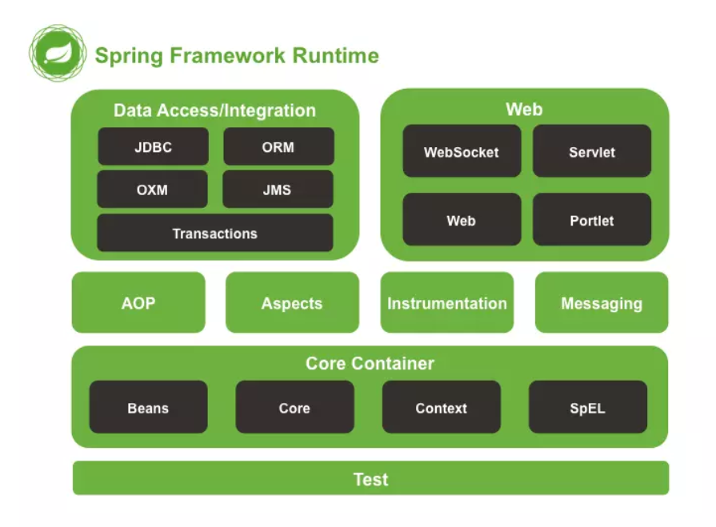

# Spring

Spring是一个轻量级Java开发框架，为了降低Java开发的复杂性，Spring采取了以下4种关键策略

- 基于POJO的轻量级和最小侵入性编程；
- 通过依赖注入和面向接口实现松耦合；
- 基于切面和惯例进行声明式编程；
- 通过切面和模板减少样板式代码。

Spring框架的核心：IoC容器和AOP模块。通过IoC容器管理POJO对象以及他们之间的耦合关系；通过AOP以动态非侵入的方式增强服务。

### Spring优缺点

#### Spring价值：

- Spring是非侵入式的框架，目标是使应用程序代码对框架依赖最小化；
- Spring提供一个一致的编程模型，使应用直接使用POJO开发，与运行环境隔离开来；
- Spring推动应用设计风格向面向对象和面向接口开发转变，提高了代码的重用性和可测试性；

#### 优点
①. 方便解耦，简化开发

​		Spring就是一个大工厂，可以将所有对象的创建和依赖关系的维护，交给Spring管理。

②. AOP编程的支持

​		Spring提供面向切面编程，可以方便的实现对程序进行权限拦截、运行监控等功能。

③. 声明式事务的支持

​		只需要通过配置就可以完成对事务的管理，而无需手动编程。

④. 方便程序的测试

​		Spring对Junit4支持，可以通过注解方便的测试Spring程序。

⑤. 方便集成各种优秀框架

​		Spring不排斥各种优秀的开源框架，其内部提供了对各种优秀框架的直接支持（如：Struts、Hibernate、MyBatis等）。

⑥. 降低JavaEE API的使用难度

​		Spring对JavaEE开发中非常难用的一些API（JDBC、JavaMail、远程调用等），都提供了封装，使这些API应用难度大大降低。

#### 缺点

- Spring明明一个很轻量级的框架，却给人感觉大而全
- Spring依赖反射，反射影响性能
- 使用门槛升高，入门Spring需要较长时间

### Spring

Spring 总共大约有 20 个模块， 由 1300 多个不同的文件构成。 而这些组件被分别整合在核心容器（Core Container） 、 AOP（Aspect Oriented Programming）和设备支持（Instrmentation） 、数据访问与集成（Data Access/Integeration） 、 Web、 消息（Messaging） 、 Test等 6 个模块中。 以下是 Spring 5 的模块结构图：

- spring core：提供了框架的基本组成部分，包括控制反转（Inversion of Control，IOC）和依赖注入（Dependency Injection，DI）功能。
- spring beans：提供了BeanFactory，是工厂模式的一个经典实现，Spring将管理对象称为Bean。
- spring context：构建于 core 封装包基础上的 context 封装包，提供了一种框架式的对象访问方法。
- spring jdbc：提供了一个JDBC的抽象层，消除了烦琐的JDBC编码和数据库厂商特有的错误代码解析， 用于简化JDBC。
- spring aop：提供了面向切面的编程实现，让你可以自定义拦截器、切点等。
- spring Web：提供了针对 Web 开发的集成特性，例如文件上传，利用 servlet listeners 进行 ioc 容器初始化和针对 Web 的 ApplicationContext。
- spring test：主要为测试提供支持的，支持使用JUnit或TestNG对Spring组件进行单元测试和集成测试。

### Spring 框架中都用到了哪些设计模式

- 工厂模式：BeanFactory就是简单工厂模式的体现，用来创建对象的实例；
- 单例模式：Bean默认为单例模式。
- 代理模式：Spring的AOP功能用到了JDK的动态代理和CGLIB字节码生成技术；
- 模板方法：用来解决代码重复的问题。比如. RestTemplate, JmsTemplate, JpaTemplate。
- 观察者模式：定义对象键一种一对多的依赖关系，当一个对象的状态发生改变时，所有依赖于它的对象都会得到通知被制动更新，如Spring中listener的实现–ApplicationListener。

### Spring控制反转（IOC）

控制反转即IoC (Inversion of Control)，它把传统上由程序代码直接操控的对象的调用权交给容器，通过容器来实现对象组件的装配和管理。所谓的“控制反转”概念就是对组件对象控制权的转移，从程序代码本身转移到了外部容器。

Spring IOC 负责创建对象，管理对象（通过依赖注入（DI），装配对象，配置对象，并且管理这些对象的整个生命周期。

#### **作用：**

- 管理对象的创建和依赖关系的维护。对象的创建并不是一件简单的事，在对象关系比较复杂时，如果依赖关系需要程序猿来维护的话，那是相当头疼的
- 解耦，由容器去维护具体的对象
- 托管了类的产生过程，比如我们需要在类的产生过程中做一些处理，最直接的例子就是代理，如果有容器程序可以把这部分处理交给容器，应用程序则无需去关心类是如何完成代理的

#### **优点：**

- IOC 或 依赖注入把应用的代码量降到最低。
- 它使应用容易测试，单元测试不再需要单例和JNDI查找机制。
- 最小的代价和最小的侵入性使松散耦合得以实现。
- IOC容器支持加载服务时的饿汉式初始化和懒加载。

#### 实现机制

Spring 中的 IoC 的实现原理就是工厂模式加反射机制。

#### 支持哪些功能

Spring 的 IoC 设计支持以下功能：

- 依赖注入
- 依赖检查
- 自动装配
- 支持集合
- 指定初始化方法和销毁方法
- 支持回调某些方法（但是需要实现 Spring 接口，略有侵入）

### Spring依赖注入

控制反转IoC是一个很大的概念，可以用不同的方式来实现。其主要实现方式有两种：依赖注入和依赖查找

依赖注入：相对于IoC而言，依赖注入(DI)更加准确地描述了IoC的设计理念。所谓依赖注入（Dependency Injection），即组件之间的依赖关系由容器在应用系统运行期来决定，也就是由容器动态地将某种依赖关系的目标对象实例注入到应用系统中的各个关联的组件之中。组件不做定位查询，只提供普通的Java方法让容器去决定依赖关系。

#### 依赖注入的方式

两种依赖方式都可以使用，构造器注入和Setter方法注入。最好的解决方案是用构造器参数实现强制依赖，setter方法实现可选依赖。

| 构造函数注入               | setter 注入                |
| :------------------------- | :------------------------- |
| 没有部分注入               | 有部分注入                 |
| 不会覆盖 setter 属性       | 会覆盖 setter 属性         |
| 任意修改都会创建一个新实例 | 任意修改不会创建一个新实例 |
| 适用于设置很多属性         | 适用于设置少量属性         |

### BeanFactory和ApplicationContext

#### **BeanFactory**

是Spring里面最低层的接口，提供了最简单的容器的功能，只提供了实例化对象和拿对象的功能；

BeanFactory在启动的时候不会去实例化Bean，中有从容器中拿Bean的时候才会去实例化；

#### **ApplicationContext**

应用上下文，继承BeanFactory接口，它是Spring的一各更高级的容器，提供了更多的有用的功能；

1) 国际化（MessageSource）

2) 访问资源，如URL和文件（ResourceLoader）

3) 载入多个（有继承关系）上下文 ，使得每一个上下文都专注于一个特定的层次，比如应用的web层  

4) 消息发送、响应机制（ApplicationEventPublisher）

5) AOP（拦截器）

ApplicationContext在启动的时候就把所有的Bean全部实例化了。它还可以为Bean配置lazy-init=true来让Bean延迟实例化；

#### 各自优点

**BeanFactory（延迟实例化）**：应用启动的时候占用资源很少；对资源要求较高的应用，比较有优势；

**ApplicationContext（不延迟实例化）**：

\1. 所有的Bean在启动的时候都加载，系统运行的速度快； 

\2. 在启动的时候所有的Bean都加载了，我们就能在系统启动的时候，尽早的发现系统中的配置问题 

\3. 建议web应用，在启动的时候就把所有的Bean都加载了。（把费时的操作放到系统启动中完成） 

### Spring Beans

Spring beans 是那些形成Spring应用的主干的java对象。它们被Spring IOC容器初始化，装配，和管理。这些beans通过容器中配置的元数据创建。比如，以XML文件中 的形式定义。

这里有三种重要的方法给Spring 容器提供配置元数据。

- XML配置文件。
- 基于注解的配置。
- 基于java的配置。

pring配置文件是个XML 文件，这个文件包含了类信息，描述了如何配置它们，以及如何相互调用。

#### Spring基于xml注入bean的几种方式

1. Set方法注入；
2. 构造器注入：①通过index设置参数的位置；②通过type设置参数类型；
3. 静态工厂注入；
4. 实例工厂；

#### 解释Spring支持的几种bean的作用域

Spring框架支持以下五种bean的作用域：

- singleton : bean在每个Spring ioc 容器中只有一个实例。
- prototype：一个bean的定义可以有多个实例。
- request：每次http请求都会创建一个bean，该作用域仅在基于web的Spring ApplicationContext情形下有效。
- session：在一个HTTP Session中，一个bean定义对应一个实例。该作用域仅在基于web的Spring ApplicationContext情形下有效。
- global-session：在一个全局的HTTP Session中，一个bean定义对应一个实例。该作用域仅在基于web的Spring ApplicationContext情形下有效。

#### Spring框架中的单例bean是线程安全的吗

不是，Spring框架中的单例bean不是线程安全的。

spring 中的 bean 默认是单例模式，spring 框架并没有对单例 bean 进行多线程的封装处理。

实际上大部分时候 spring bean 无状态的（比如 dao 类），所有某种程度上来说 bean 也是安全的，但如果 bean 有状态的话（比如 view model 对象），那就要开发者自己去保证线程安全了，最简单的就是改变 bean 的作用域，把“singleton”变更为“prototype”，这样请求 bean 相当于 new Bean()了，所以就可以保证线程安全了。

- 有状态就是有数据存储功能。
- 无状态就是不会保存数据。

#### spring 自动装配 bean 有哪些方式

在Spring框架xml配置中共有5种自动装配：

- no：默认的方式是不进行自动装配的，通过手工设置ref属性来进行装配bean。
- byName：通过bean的名称进行自动装配，如果一个bean的 property 与另一bean 的name 相同，就进行自动装配。
- byType：通过参数的数据类型进行自动装配。
- constructor：利用构造函数进行装配，并且构造函数的参数通过byType进行装配。
- autodetect：自动探测，如果有构造方法，通过 construct的方式自动装配，否则使用 byType的方式自动装配。

### Spring数据访问

#### 解释对象/关系映射集成模块

Spring 通过提供ORM模块，支持我们在直接JDBC之上使用一个对象/关系映射映射(ORM)工具，Spring 支持集成主流的ORM框架，

#### 在Spring框架中如何更有效地使用JDBC

使用Spring JDBC 框架，资源管理和错误处理的代价都会被减轻。所以开发者只需写statements 和 queries从数据存取数据，JDBC也可以在Spring框架提供的模板类的帮助下更有效地被使用，这个模板叫JdbcTemplate

#### 解释JDBC抽象和DAO模块

通过使用JDBC抽象和DAO模块，保证数据库代码的简洁，并能避免数据库资源错误关闭导致的问题，它在各种不同的数据库的错误信息之上，提供了一个统一的异常访问层。它还利用Spring的AOP 模块给Spring应用中的对象提供事务管理服务。

####  spring DAO 

Spring DAO（数据访问对象） 使得 JDBC，Hibernate 或 JDO 这样的数据访问技术更容易以一种统一的方式工作。这使得用户容易在持久性技术之间切换。它还允许您在编写代码时，无需考虑捕获每种技术不同的异常。

####  spring JDBC API 中存在哪些类

- JdbcTemplate
- SimpleJdbcTemplate
- NamedParameterJdbcTemplate
- SimpleJdbcInsert
- SimpleJdbcCall

#### JdbcTemplate

JdbcTemplate 类提供了很多便利的方法解决诸如把数据库数据转变成基本数据类型或对象，执行写好的或可调用的数据库操作语句，提供自定义的数据错误处理。

### Spring事务

#### Spring支持的事务管理类型

Spring支持两种类型的事务管理：

编程式事务管理：这意味你通过编程的方式管理事务，给你带来极大的灵活性，但是难维护。

声明式事务管理：这意味着你可以将业务代码和事务管理分离，你只需用注解和XML配置来管理事务。

#### Spring事务的实现方式和实现原理

Spring事务的本质其实就是数据库对事务的支持，没有数据库的事务支持，spring是无法提供事务功能的。真正的数据库层的事务提交和回滚是通过binlog或者redo log实现的。

####  spring 的事务隔离

spring 有五大隔离级别，默认值为 ISOLATION_DEFAULT（使用数据库的设置），其他四个隔离级别和数据库的隔离级别一致：

- ISOLATION_DEFAULT：用底层数据库的设置隔离级别，数据库设置的是什么我就用什么；
- ISOLATION_READ_UNCOMMITTED：未提交读，最低隔离级别、事务未提交前，就可被其他事务读取（会出现幻读、脏读、不可重复读）；
- ISOLATION_READ_COMMITTED：提交读，一个事务提交后才能被其他事务读取到（会造成幻读、不可重复读），SQL server 的默认级别；
- ISOLATION_REPEATABLE_READ：可重复读，保证多次读取同一个数据时，其值都和事务开始时候的内容是一致，禁止读取到别的事务未提交的数据（会造成幻读），MySQL 的默认级别；
- ISOLATION_SERIALIZABLE：序列化，代价最高最可靠的隔离级别，该隔离级别能防止脏读、不可重复读、幻读。

#### Spring框架的事务管理有哪些优点

- 为不同的事务API 如 JTA，JDBC，Hibernate，JPA 和JDO，提供一个不变的编程模式。
- 为编程式事务管理提供了一套简单的API而不是一些复杂的事务API
- 支持声明式事务管理。
- 和Spring各种数据访问抽象层很好得集成。

### Spring AOP

OOP(Object-Oriented Programming)面向对象编程，允许开发者定义纵向的关系，但并适用于定义横向的关系，导致了大量代码的重复，而不利于各个模块的重用。

AOP(Aspect-Oriented Programming)，一般称为面向切面编程，作为面向对象的一种补充，用于将那些与业务无关，但却对多个对象产生影响的公共行为和逻辑，抽取并封装为一个可重用的模块，这个模块被命名为“切面”（Aspect），减少系统中的重复代码，降低了模块间的耦合度，同时提高了系统的可维护性。可用于权限认证、日志、事务处理等。

#### Spring AOP and AspectJ AOP 有什么区别？AOP 有哪些实现方式？

AOP实现的关键在于 代理模式，AOP代理主要分为静态代理和动态代理。静态代理的代表为AspectJ；动态代理则以Spring AOP为代表。

（1）AspectJ是静态代理的增强，所谓静态代理，就是AOP框架会在编译阶段生成AOP代理类，因此也称为编译时增强，他会在编译阶段将AspectJ(切面)织入到Java字节码中，运行的时候就是增强之后的AOP对象。

（2）Spring AOP使用的动态代理，所谓的动态代理就是说AOP框架不会去修改字节码，而是每次运行时在内存中临时为方法生成一个AOP对象，这个AOP对象包含了目标对象的全部方法，并且在特定的切点做了增强处理，并回调原对象的方法。

# SpringBoot

#### springboot 自动配置

# SpringCloud

### 微服务如何通信

**同步（REST HTTP协议，RPC TCP 协议）**

**异步（消息中间件，例如Kafka、ActiveMQ、RabbitMQ、RocketMQ）**

### Dubbo 和 SpringCloud对比

dubbo**专注于RPC通信**（通过服务器代理将方法参数序列号和解码的过程，不同的服务器调用对方的方法）

springcloud使用的是基于HTTP的REST方式

dubbo就是单独的一个功能组件，而springcloud提供了一站式解决分布式问题。

| | Dubbo | SpringCloud |
| ------ | ------------- | ---------------------------- |
| 服务注册中心 | Zookeeper | Spring Cloud Netfilx Eureka |
| 服务调用方式 | RPC | REST API |
| 服务监控 | Dubbo-monitor | Spring Boot Admin |
| 断路器 | 不完善 | Spring Cloud Netfilx Hystrix |
| 服务网关 | 无 | Spring Cloud Netfilx Zuul |
| 分布式配置 | 无 | Spring Cloud Config |
| 服务跟踪 | 无 | Spring Cloud Sleuth |
| 消息总栈 | 无 | Spring Cloud Bus |
| 数据流 | 无 | Spring Cloud Stream |
| 批量任务 | 无 | Spring Cloud Task |

### SpringBoot 和 SpringCloud

springboot专注于快速方便得单个个体微服务；springcloud是关注全局得微服务协调整理治理框架。

### 服务熔断，服务降级

**服务熔断（提供者）**

Hystrix**解决服务雪崩**的方案（**服务熔断**）：在不可用的服务中**服务端给调用方返回备用响应**，就可以继续运行调用之后的服务，就可以避免长时间的等待或抛出无法解决的异常，无法释放调用线程，导致服务雪崩

**服务降级（消费者）**

当某个时间段**访问压力大**，需要**停掉不重要的某些功能（例如：广告。。）**，释放占用资源以保证**主要核心重要业务**能够顺利完成，而消费者调用这些不重要功能时，**客户端会返回备用响应**

### 微服务优缺点

> 优点

- 单一职责原则；
- 每个服务足够内聚，足够小，代码容易理解，这样能聚焦一个指定的业务功能或业务需求；
- 开发简单，开发效率高，一个服务可能就是专一的只干一件事；
- 微服务能够被小团队单独开发，这个团队只需2-5个开发人员组成；
- 微服务是松耦合的，是有功能意义的服务，无论是在开发阶段或部署阶段都是独立的；
- 微服务能使用不同的语言开发；
- 易于和第三方集成，微服务允许容易且灵活的方式集成自动部署，通过持续集成工具，如jenkins，Hudson，bamboo；
- 微服务易于被一个开发人员理解，修改和维护，这样小团队能够更关注自己的工作成果，无需通过合作才能体现价值；
- 微服务允许利用和融合最新技术；
- **微服务只是业务逻辑的代码，不会和HTML，CSS，或其他的界面混合;**
- **每个微服务都有自己的存储能力，可以有自己的数据库，也可以有统一的数据库；**

> 缺点

- 开发人员要处理分布式系统的复杂性；
- 多服务运维难度，随着服务的增加，运维的压力也在增大；
- 系统部署依赖问题；
- 服务间通信成本问题；
- 数据一致性问题；
- 系统集成测试问题；
- 性能和监控问题；

### 微服务技术栈

springcloud使用**Eureka**（u瑞卡）注册中心，**Ribbon**（瑞本）负载均衡， **Feign**（费因）接口调用服务，**Hystrix**（哈瑞丝吹克丝） （熔断机制，dashboard监控）， **zuul**（祖尔）路由网关，**config**连接git配置中心

| **微服务技术条目**                     | 落地技术                                                     |
| -------------------------------------- | ------------------------------------------------------------ |
| 服务开发                               | SpringBoot、Spring、SpringMVC等                              |
| 服务配置与管理                         | Netfix公司的Archaius、阿里的Diamond等                        |
| 服务注册与发现                         | Eureka、Consul、Zookeeper等                                  |
| 服务调用                               | Rest、PRC、gRPC                                              |
| 服务熔断器                             | Hystrix、Envoy等                                             |
| 负载均衡                               | Ribbon、Nginx等                                              |
| 服务接口调用(客户端调用服务的简化工具) | Fegin等                                                      |
| 消息队列                               | Kafka、RabbitMQ、ActiveMQ等                                  |
| 服务配置中心管理                       | SpringCloudConfig、Chef等                                    |
| 服务路由(API网关)                      | Zuul、gateway                                                |
| 服务监控                               | Zabbix、Nagios、Metrics、Specatator等                        |
| 全链路追踪                             | Zipkin、Brave、Dapper等                                      |
| 数据流操作开发包                       | SpringCloud Stream(封装与Redis，Rabbit，Kafka等发送接收消息) |
| 时间消息总栈                           | SpringCloud Bus                                              |
| 服务部署                               | Docker、OpenStack、Kubernetes等                              |

### **Eureka和Zookeeper都可以提供服务注册与发现的功能，请说说两者的区别**

##### **CAP是什么?**

- C (Consistency) 一致性
- A (Availability) 可用性
- P (Partition tolerance) 分区容错性

- 一致性（C）：在分布式系统中的所有数据备份，在同一时刻是否同样的值。（等同于**所有节点访问同一份最新的数据副本**）

- 可用性（A）：**不管什么时候访问，都可以正常的获取数据值。**好的可用性主要是指系统能够很好的为用户服务，不出现用户操作失败或者访问超时等用户体验不好的情况。

- 分区容忍性（P）：分区容错性指在遇到**某节点或网络分区故障**的时候，**能够在其他的节点，访问到故障节点的内容**（即通过拷贝，每个节点内容都是一样的）

##### CAP的三进二

（只能保持两个同时实现，不能一起实现）：CA、AP、CP

因为在实现分布式时，必须考虑分区容忍性（P），因为节点随时会崩，需要集群实现，**每个节点都拷贝相同的内容以保证内容一样**，

不等待所有节点拷贝完成就使用，一致性（C）不能保证，因为**一致性需要所有节点在任何时间访问的内容都必须一样**，

等待所有节点拷贝完成才使用，可用性（A）不能保证，因为**必须等待完成，在那个时间段不能使用**

著名的CAP理论指出，一个分布式系统不可能同时满足C (一致性) 、A (可用性) 、P (容错性)，由于分区容错性P再分布式系统中是必须要保证的，因此我们只能再A和C之间进行权衡。

- Zookeeper 保证的是 CP —> 满足一致性，分区容错的系统，通常性能不是特别高
- Eureka 保证的是 AP —> 满足可用性，分区容错的系统，通常可能对一致性要求低一些

##### **Zookeeper保证的是CP**

（网络问题导致master节点宕机，选举时间长，集群无法使用，无法保证可用性）

当向注册中心查询服务列表时，我们可以容忍注册中心返回的是几分钟以前的注册信息，但不能接收服务直接down掉不可用。也就是说，**服务注册功能对可用性的要求要高于一致性**。但zookeeper会出现这样一种情况，当master节点因为网络故障与其他节点失去联系时，剩余节点会重新进行leader选举。问题在于，**选举leader的时间太长**，30-120s，且选举期间整个zookeeper集群是不可用的，这就导致在选举期间注册服务瘫痪。在云部署的环境下，因为网络问题使得zookeeper集群失去master节点是较大概率发生的事件，虽然服务最终能够恢复，但是，漫长的选举时间导致注册长期不可用，是不可容忍的。

##### **Eureka保证的是AP**

（网络有问题时触发自我保护机制，不会移除过期服务，同时能接受新服务，保证可用性，而不会同步到其他节点，无法保证一致性

Eureka看明白了这一点，因此在设计时就优先保证可用性。**Eureka各个节点都是平等的**，几个节点挂掉不会影响正常节点的工作，剩余的节点依然可以提供注册和查询服务。而Eureka的客户端在向某个Eureka注册时，如果发现连接失败，则会自动切换至其他节点，只要有一台Eureka还在，就能保住注册服务的可用性，只不过查到的信息可能不是最新的，除此之外，Eureka还有之中自我保护机制，如果在15分钟内超过85%的节点都没有正常的心跳，那么Eureka就认为客户端与注册中心出现了网络故障，此时会出现以下几种情况：

- Eureka不在从注册列表中移除因为长时间没收到心跳而应该过期的服务
- Eureka仍然能够接受新服务的注册和查询请求，但是不会被同步到其他节点上 (即保证当前节点依然可用)
- 当网络稳定时，当前实例新的注册信息会被同步到其他节点中

**因此，Eureka可以很好的应对因网络故障导致部分节点失去联系的情况，而不会像zookeeper那样使整个注册服务瘫痪**

### **Zuul**和Gateway

底层都是servlet、两者都是web网关，处理的是http请求。

**Zuul：**

​	使用的是阻塞式的 API，不支持长连接，比如 websockets。

​	底层是servlet，Zuul处理的是http请求

​	没有提供异步支持，流控等均由hystrix支持。

​	依赖包spring-cloud-starter-netflix-zuul。

**Gateway：**

​	Spring Boot和Spring Webflux提供的Netty底层环境，不能和传统的Servlet容器一起使用，也不能打包成一个WAR包。

​	依赖spring-boot-starter-webflux和/ spring-cloud-starter-gateway

​	提供了异步支持，提供了抽象负载均衡，提供了抽象流控，并默认实现了RedisRateLimiter。

### 什么是Spring Cloud Bus

spring cloud bus 将分布式的节点用轻量的消息代理连接起来，它可以用于广播配置文件的更改或者服务直接的通讯，也可用于监控。

如果修改了配置文件，发送一次请求，所有的客户端便会重新读取配置文件。

**使用:**

**1、** 添加依赖

**2、** 配置rabbimq

